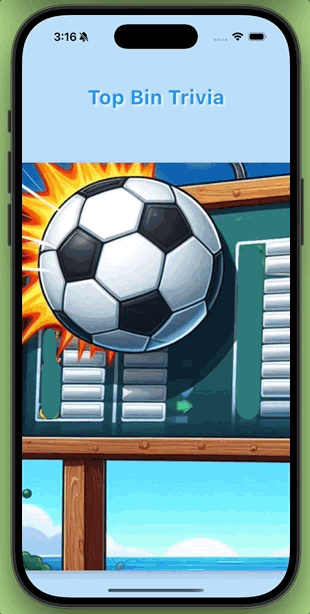

# ⚽🌍 TopBinTrivia

Dive into this trivia game that spans dozens of countries worldwide! Choose a country, test your knowledge of epic global soccer events, and learn fascinating facts as you go. Each round earns you a score—so challenge yourself, play multiple rounds, and see how you stack up. Let the games begin! ⚽🏆

  

## 🚀 Key Features

🗺 **Explore Global Soccer History**  
Pick from dozens of countries and dive into iconic matches, legendary players, and unforgettable moments.

🧠 **Test Your Knowledge**  
Challenge yourself with multiple-choice questions covering World Cups, continental tournaments, and more.

🔄 **Play Multiple Rounds**  
Replay different countries and events improve your scores.

🌟 **Learn as You Play**  
Expand your understanding of global soccer while having fun. Every question is a chance to discover something new!

## 📱 Download for iOS

Download on the App Store  

## 📝 License

TopBinTrivia is under the MIT license. See the accompanying [LICENSE](LICENSE) for more information.

## 🤝 Contributing

We welcome 👩🏾‍💻👨🏾‍💻 additions! If you’d like to help improve or expand this project, feel free to open an issue or submit a pull request.

## 📬 Contact

For feedback, questions, or collaboration opportunities, feel free to message for assistance.
